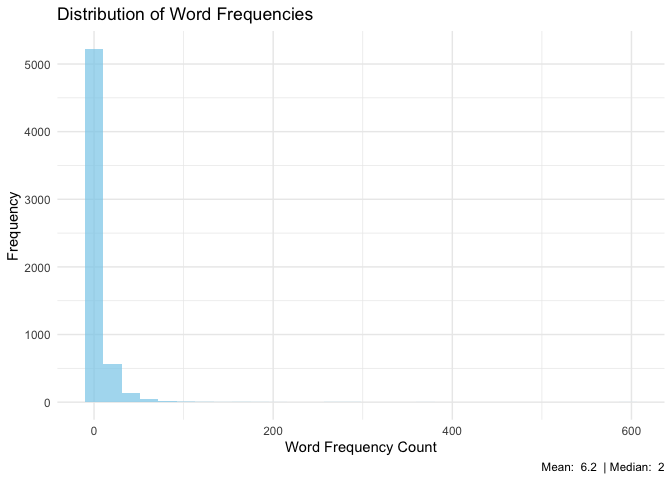
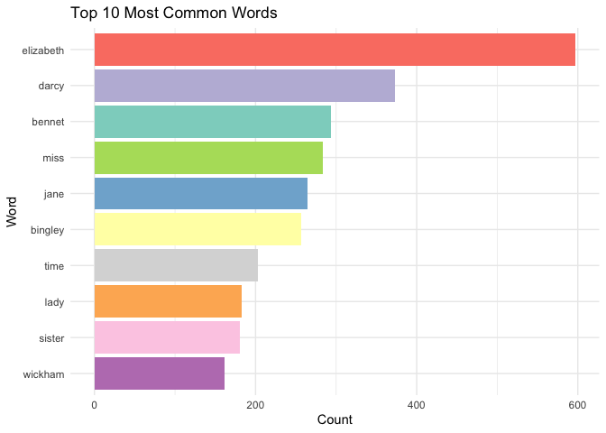
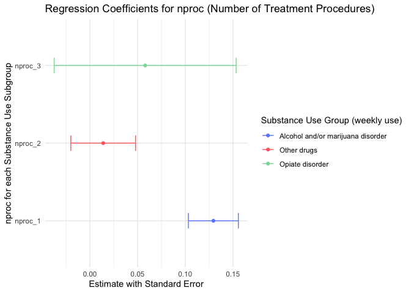
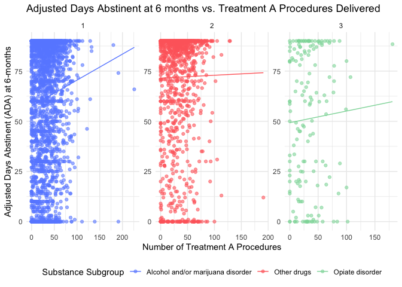

STAT 545B Assignment B4 - Andrea Wong Koo: Option A
================
2024-12-5

``` r
library(tidyverse)
```

    ## ── Attaching core tidyverse packages ──────────────────────── tidyverse 2.0.0 ──
    ## ✔ dplyr     1.1.4     ✔ readr     2.1.5
    ## ✔ forcats   1.0.0     ✔ stringr   1.5.1
    ## ✔ ggplot2   3.5.1     ✔ tibble    3.2.1
    ## ✔ lubridate 1.9.3     ✔ tidyr     1.3.1
    ## ✔ purrr     1.0.2     
    ## ── Conflicts ────────────────────────────────────────── tidyverse_conflicts() ──
    ## ✖ dplyr::filter() masks stats::filter()
    ## ✖ dplyr::lag()    masks stats::lag()
    ## ℹ Use the conflicted package (<http://conflicted.r-lib.org/>) to force all conflicts to become errors

``` r
library(stringr)
library(janeaustenr)
library(ggplot2)
library(tidytext)
library(RColorBrewer)
library(datasets)
library(forcats)
library(OVtool) #for `sud` dataset
```

    ## Loading required package: twang
    ## To reproduce results from prior versions of the twang package, please see the version="legacy" option described in the documentation.

``` r
library(broom)
library(cowplot)
```

    ## 
    ## Attaching package: 'cowplot'
    ## 
    ## The following object is masked from 'package:lubridate':
    ## 
    ##     stamp

# Exercise 1:

*Take a Jane Austen book contained in the `janeaustenr` package, or
another book from some other source, such as one of the many freely
available books from [Project Gutenberg](https://dev.gutenberg.org/) (be
sure to indicate where you got the book from). Make a plot of the most
common words in the book, removing “stop words” of your choosing (words
like “the”, “a”, etc.) or stopwords from a pre-defined source, like the
`stopwords` package or `tidytext::stop_words`.*

*If you use any resources for helping you remove stopwords, or some
other resource besides the `janeaustenr` R package for accessing your
book, please indicate the source. We aren’t requiring any formal
citation styles, just make sure you name the source and link to it.*

- Book source:
  <https://cran.r-project.org/web/packages/janeaustenr/janeaustenr.pdf>

``` r
# To create an object for one of the books in the `janeaustenr` package:
book_text <- austen_books() %>%
  filter(book == "Pride & Prejudice") %>% 
  select(text)

head(book_text)
```

    ## # A tibble: 6 × 1
    ##   text                 
    ##   <chr>                
    ## 1 "PRIDE AND PREJUDICE"
    ## 2 ""                   
    ## 3 "By Jane Austen"     
    ## 4 ""                   
    ## 5 ""                   
    ## 6 ""

``` r
# To explore the data structure of the stop words available in tidytext: 
glimpse(tidytext::stop_words)
```

    ## Rows: 1,149
    ## Columns: 2
    ## $ word    <chr> "a", "a's", "able", "about", "above", "according", "accordingl…
    ## $ lexicon <chr> "SMART", "SMART", "SMART", "SMART", "SMART", "SMART", "SMART",…

- `tidytext::unnest_tokens()` source:
  <https://www.rdocumentation.org/packages/tidytext/versions/0.4.2/topics/unnest_tokens>

Using `tidytext` and `purrr` functions, the code below

``` r
# To produce and count frequencies of words in book, with stop words removed: 
common_words <- book_text %>%
  
  # To tokenize the text into individual words: 
  tidytext::unnest_tokens(output = book_word, input = text) %>% 
  
  # Remove stop words by filtering out words that appear in the 'stop_words' dataset:
  filter(!purrr::map_lgl(book_word, ~.x %in% stop_words[["word"]])) %>%
  
  # Count the occurrences of each unique word, sorted in descending order: 
  count(book_word, name = "count", sort = TRUE)

print(common_words)
```

    ## # A tibble: 6,009 × 2
    ##    book_word count
    ##    <chr>     <int>
    ##  1 elizabeth   597
    ##  2 darcy       373
    ##  3 bennet      294
    ##  4 miss        283
    ##  5 jane        264
    ##  6 bingley     257
    ##  7 time        203
    ##  8 lady        183
    ##  9 sister      180
    ## 10 wickham     162
    ## # ℹ 5,999 more rows

To gain an idea of the gain idea of the distribution of word frequencies
with summary statistics:

``` r
# To produce summary statistics:
common_words_summary <- common_words %>%
  summarize(
    mean_count = mean(count),
    max_count = max(count),
    min_count = min(count),
    median_count = median(count),
    q1 = quantile(count, 0.25),
    q3 = quantile(count, 0.75),
    .groups = "drop"  # In case of grouping, ensures it doesn't propagate
  )

print(common_words_summary)
```

    ## # A tibble: 1 × 6
    ##   mean_count max_count min_count median_count    q1    q3
    ##        <dbl>     <int>     <int>        <int> <dbl> <dbl>
    ## 1       6.20       597         1            2     1     5

``` r
# To plot the distribution plot for word counts:
word_distribution <- ggplot(common_words, aes(x = count)) +
  geom_histogram(bins = 30, fill = "skyblue", alpha = 0.7) +
  labs(
    title = "Distribution of Word Frequencies",
    x = "Word Frequency Count",
    y = "Frequency",
    caption = paste("Mean: ", round(common_words_summary$mean_count, 2), 
                    " | Median: ", round(common_words_summary$median_count, 2))
  ) +
  theme_minimal()

print(word_distribution)
```

<!-- -->

Based on the distribution of word frequencies, it seems like it is right
skewed, with very high counts, it would be acceptable to choose the top
10 most frequently used words.

``` r
# To view the top 10 most common words with the highest counts:
top_10_common_words <- head(common_words, 10) # Returns the top 10 rows

print(top_10_common_words)
```

    ## # A tibble: 10 × 2
    ##    book_word count
    ##    <chr>     <int>
    ##  1 elizabeth   597
    ##  2 darcy       373
    ##  3 bennet      294
    ##  4 miss        283
    ##  5 jane        264
    ##  6 bingley     257
    ##  7 time        203
    ##  8 lady        183
    ##  9 sister      180
    ## 10 wickham     162

Below is a visualization of the counts for the top 10 most common words.
Based on the graph, the most common word is ‘elizabeth’ with a 600 word
frequency count.

``` r
# To visualize the counts of the top 10 most common words: 
common_words_plot <- top_10_common_words %>%
  ggplot(aes(x = reorder(book_word, count), y = count, fill = book_word)) +
  geom_bar(stat = "identity") + # Create bar plot for each common word
  coord_flip() + # For readability, flip coordinate to horizontal orientation: 
  labs(x = "Word", y = "Count", title = "Top 10 Most Common Words") +
  theme_minimal() +
  scale_fill_brewer(palette = "Set3") + # Uses a colour palette for bars
  theme(legend.position = "none") # Removes the legend
 
print(common_words_plot)
```

<!-- -->

# Exercise 3

*For this exercise, you’ll be evaluating a model that’s fit separately
for each group in some dataset. You should fit these models with some
question in mind.*

This data analysis uses a synthetic data set called `sud` from
library(Ovtool), derived from a large-scale observational study on 4000
youth in substance use disorder treatment. The specific names of two
different types of treatments are not specified, but are named
“Treatment A” and “Treatment B”.

For this data analysis, we are interested in abstinence duration
recorded at six months for treatment A, which is a treatment outcome. To
analyze and predict this outcome of interest, we will specifically look
at the number of treatment A procedures delivered to a client.

**Dataset source:**
<https://cran.r-project.org/web/packages/OVtool/vignettes/OVtool.html>

**Objective:** To build a linear regression model of number of abstinent
days at a 6-month check point, based on number of treatment procedures
for each substance use subgroup.

**Research Question:** How does the number of treatment A procedures
affect and predict abstinence within 6 months of treatment within
different substance use groups?

To carry out this data analysis, follow along with the steps.

## Question 1

*Question 1: Make a column of model objects. Do this using the
appropriate mapping function from the purrr package. Note: it’s possible
you’ll have to make use of nesting, here.*

First, we explore the documentation and data structure of the `sud`
dataset to understand the variables available, data types of each
variable, and a preview of the values.

``` r
# To view documentation of dataset:
?sud
```

``` r
# To preview the dataset values:
head(sud)
```

    ## # A tibble: 6 × 29
    ##   treat tss_0 tss_3    tss_6 sfs8p_0 sfs8p_3 sfs8p_6 eps7p_0 eps7p_3 eps7p_6
    ##   <chr> <dbl> <dbl>    <dbl>   <dbl>   <dbl>   <dbl>   <dbl>   <dbl>   <dbl>
    ## 1 A         0 5     0          0        4.99  14.7    0.151  0.288    0     
    ## 2 A         0 0.578 5.30e- 1  11.5      3.19   3.75   0.0476 0.00760  0.171 
    ## 3 A         0 0     2.37e+ 0  40.6     29.7    0.833  0.0952 0.286    0.0476
    ## 4 A         0 0     0         29.7      8.89   4.58   0.0730 0.0778   0     
    ## 5 A         0 2.65  5.55e-17  22.2     22.2    0.833  0.286  0.387    0.0952
    ## 6 A         8 4.99  0          0.694    0      0      0.438  0.321    0.0476
    ## # ℹ 19 more variables: ias5p_0 <dbl>, dss9_0 <dbl>, mhtrt_0 <dbl>,
    ## #   sati_0 <dbl>, sp_sm_0 <dbl>, sp_sm_3 <dbl>, sp_sm_6 <dbl>, gvs <dbl>,
    ## #   ers21_0 <dbl>, nproc <dbl>, ada_0 <dbl>, ada_3 <dbl>, ada_6 <dbl>,
    ## #   recov_0 <dbl>, recov_3 <dbl>, recov_6 <dbl>, subsgrps_n <dbl>, sncnt <dbl>,
    ## #   engage <dbl>

``` r
# To view the data structure of dataset including variables and data types: 
glimpse(sud)
```

    ## Rows: 4,000
    ## Columns: 29
    ## $ treat      <chr> "A", "A", "A", "A", "A", "A", "A", "A", "A", "A", "A", "A",…
    ## $ tss_0      <dbl> 0, 0, 0, 0, 0, 8, 0, 5, 2, 0, 0, 0, 0, 9, 8, 0, 0, 6, 7, 0,…
    ## $ tss_3      <dbl> 5.000000000, 0.578128019, 0.000000000, 0.000000000, 2.65083…
    ## $ tss_6      <dbl> 0.000000e+00, 5.297880e-01, 2.371451e+00, 0.000000e+00, 5.5…
    ## $ sfs8p_0    <dbl> 0.0000000, 11.5277778, 40.5555556, 29.7222222, 22.2222222, …
    ## $ sfs8p_3    <dbl> 4.9859511, 3.1944444, 29.7222222, 8.8888889, 22.2222222, 0.…
    ## $ sfs8p_6    <dbl> 14.7222222, 3.7500000, 0.8333333, 4.5833333, 0.8333333, 0.0…
    ## $ eps7p_0    <dbl> 0.15079365, 0.04761905, 0.09523810, 0.07301587, 0.28571429,…
    ## $ eps7p_3    <dbl> 0.287629537, 0.007595141, 0.285714286, 0.077777778, 0.38730…
    ## $ eps7p_6    <dbl> 0.00000000, 0.17142857, 0.04761905, 0.00000000, 0.09523810,…
    ## $ ias5p_0    <dbl> 6.666667, 0.000000, 22.222222, 0.000000, 10.444444, 0.00000…
    ## $ dss9_0     <dbl> 0, 3, 0, 1, 2, 8, 0, 2, 0, 6, 0, 1, 0, 9, 8, 1, 2, 6, 7, 0,…
    ## $ mhtrt_0    <dbl> 0, 0, 0, 0, 1, 2, 0, 0, 0, 0, 0, 0, 0, 2, 0, 0, 0, 0, 1, 0,…
    ## $ sati_0     <dbl> 43.333333, 0.000000, 2.222222, 4.444444, 0.000000, 0.000000…
    ## $ sp_sm_0    <dbl> 0, 2, 2, 0, 6, 0, 1, 6, 7, 6, 0, 1, 1, 7, 6, 0, 1, 10, 0, 1…
    ## $ sp_sm_3    <dbl> 0.000000e+00, 4.777907e-01, 4.000000e+00, 0.000000e+00, 0.0…
    ## $ sp_sm_6    <dbl> 4.00000000, 2.24515818, 3.09696501, 0.00000000, 0.04248530,…
    ## $ gvs        <dbl> 3, 0, 0, 1, 0, 5, 0, 0, 0, 2, 0, 0, 0, 10, 12, 3, 1, 7, 0, …
    ## $ ers21_0    <dbl> 34, 21, 41, 39, 30, 24, 38, 32, 34, 43, 33, 24, 37, 39, 31,…
    ## $ nproc      <dbl> 30.338621, 17.000000, 0.000000, 9.991401, 19.000000, 5.3090…
    ## $ ada_0      <dbl> 20, 51, 5, 25, 30, 86, 82, 40, 10, 23, 83, 48, 76, 50, 60, …
    ## $ ada_3      <dbl> 74.00000, 80.00000, 5.00000, 55.00000, 34.75114, 90.00000, …
    ## $ ada_6      <dbl> 52.68790, 90.00000, 83.30385, 74.00000, 87.00000, 90.00000,…
    ## $ recov_0    <dbl> 1, 0, 0, 0, 0, 0, 0, 0, 0, 0, 0, 0, 0, 0, 0, 1, 0, 0, 0, 0,…
    ## $ recov_3    <dbl> 1, 0, 0, 0, 1, 1, 0, 1, 1, 0, 0, 1, 1, 0, 0, 1, 1, 0, 0, 0,…
    ## $ recov_6    <dbl> 0, 1, 0, 0, 1, 1, 0, 1, 0, 0, 0, 1, 0, 1, 0, 1, 1, 0, 0, 1,…
    ## $ subsgrps_n <dbl> 1, 1, 1, 1, 1, 2, 1, 1, 1, 1, 1, 1, 2, 2, 1, 2, 1, 1, 1, 2,…
    ## $ sncnt      <dbl> 22, 15, NA, 5, 6, 2, 7, NA, 6, 4, 18, 19, NA, 19, 3, 25, 16…
    ## $ engage     <dbl> 1, 1, NA, 0, 1, 0, 0, NA, 1, 0, 1, 1, NA, 1, 0, 1, 1, NA, 0…

After referring to the dataset source link and reviewing the data
structure, the relevant variables for this analysis are:

- **Outcome of interest:** `ada_6`: adjusted days abstinent (ADA)
  recorded at 6-months, a continuous numeric variable that functions as
  a treatment outcome.

- **Predictor variable/variable of interest:** `npoc`: the count of
  Treatment A procedures delivered to client, a continuous numeric
  variable.

- **subsgrps_n**: Since the dataset includes individuals who use
  different drugs, it would make sense to group the linear regression by
  substance subgroups to compare the effect of treatments on abstinence
  specific to each substance. Hence, the data analysis will group by
  `subsgrps_n`, which is a categorical variable where 1=“Alcohol and/or
  marijuana disorder/weekly use; 2=”Other drugs”; 3=“Opiate
  disorder/weekly use”.

Now that we have explored the variables in the dataset, we will make a
column of model objects, where each row is a linear regression model,
with Y outcome variable as `ada_6` and X predictor variable as `nproc`.

``` r
# To create a column of linear model objects: 
sud_models <- sud %>%
  select(subsgrps_n, nproc, ada_6) %>% # To select relevant variables: 
  drop_na() %>%  # Removes missing values for linear regression functionality
  mutate(as_factor(subsgrps_n)) %>% # Ensures that `subsgrps_n` values are factors
  group_by(subsgrps_n) %>% # Group by subsgrps_n to fit models separately for each group
  nest(data = c(nproc, ada_6)) %>% # Nest data for each subsgrps_n groups
  mutate(model = map(data, ~ lm(ada_6 ~ nproc, data = .))) # Fitting the linear model

head(sud_models)
```

    ## # A tibble: 3 × 4
    ## # Groups:   subsgrps_n [3]
    ##   subsgrps_n `as_factor(subsgrps_n)` data                 model 
    ##        <dbl> <fct>                   <list>               <list>
    ## 1          1 1                       <tibble [2,557 × 2]> <lm>  
    ## 2          2 2                       <tibble [1,280 × 2]> <lm>  
    ## 3          3 3                       <tibble [163 × 2]>   <lm>

## Question 2:

*Question 2: Evaluate the model in a way that interests you. But, you
should evaluate something other than a single number for each group.
Hint: you’ll need to use another purrr mapping function again.*

To both analyze trends and predict abstinence given a number of
treatment A procedures, we will evaluate both the regression
coefficients using `broom::tidy`, and fitting values with
`broom::augment`.

``` r
# To evaluate the regression coefficients (tidy output): 
sud_lm_tidy <- sud_models %>%
  mutate(tidy_output = map(model, broom::tidy))
```

``` r
# To fit values and residuals (augment output): 
sud_lm_augment <- sud_models %>%
  mutate(augmented_data = map(model, broom::augment, .keep = "none"))
```

## Question 3:

*Question 3: Print out this intermediate tibble for inspection (perhaps
others as well, if it makes sense to do so).*

Below are the outputs of the model evaluations:

``` r
# Prints the tidy output: 
print(sud_lm_tidy)
```

    ## # A tibble: 3 × 5
    ## # Groups:   subsgrps_n [3]
    ##   subsgrps_n `as_factor(subsgrps_n)` data                 model  tidy_output
    ##        <dbl> <fct>                   <list>               <list> <list>     
    ## 1          1 1                       <tibble [2,557 × 2]> <lm>   <tibble>   
    ## 2          2 2                       <tibble [1,280 × 2]> <lm>   <tibble>   
    ## 3          3 3                       <tibble [163 × 2]>   <lm>   <tibble>

``` r
# Prints the augment output: 
print(sud_lm_augment)
```

    ## # A tibble: 3 × 5
    ## # Groups:   subsgrps_n [3]
    ##   subsgrps_n `as_factor(subsgrps_n)` data                 model  augmented_data
    ##        <dbl> <fct>                   <list>               <list> <list>        
    ## 1          1 1                       <tibble [2,557 × 2]> <lm>   <tibble>      
    ## 2          2 2                       <tibble [1,280 × 2]> <lm>   <tibble>      
    ## 3          3 3                       <tibble [163 × 2]>   <lm>   <tibble>

## Question 4:

*Question 4: Unnest the resulting calculations, and print your final
tibble to screen. Make sure your tibble makes sense: column names are
appropriate, and you’ve gotten rid of columns that no longer make
sense.*

To view the results of the models, we can unnest and only include the
most informative columns.

### Tidy output:

**Tidy output interpretation:** For the tidy output, The `term` column
includes the intercept and the coefficient for nproc, with the
corresponding `estimate`, `std.error`, `statistic`, and `p.value`
columns. The `intercept` represents the starting point of the regression
line. The `estimate` represents the effect of the predictor on the
outcome, the `std.error` is the standard error of the estimate,
statistic is the test statistic (e.g., t-value), and `p.value` indicates
whether the relationship is statistically significant.

Comparing the linear regression coefficients, the Alcohol and/or
marijuana disorder/weekly use group (group 1) shows a statistically
significant positive relationship between the number of treatment
procedures (`nproc`) and the number of days abstinent at 6-month
checkpoint (`apa_6`). The coefficient of 0.13 with p \< 0.001, suggests
that more treatment procedures correlate with a slightly higher
likelihood of abstinence.

In contrast, the Other drugs (group 2)and Opiate disorder/weekly use
group (group 3) do not show a statistically significant relationship
between the number of treatment procedures and abstinence, with very
small and non-significant coefficients of 0.01 and 0.06, respectively
with p \> 0.5.

``` r
# To unnest the model tidy output:
final_sud_tidy <- sud_lm_tidy %>%
  unnest(tidy_output) %>%  # Unnest the list-column containing the tidy output
  select(subsgrps_n, term, estimate, std.error, statistic, p.value)  # Keep relevant columns

print(final_sud_tidy)
```

    ## # A tibble: 6 × 6
    ## # Groups:   subsgrps_n [3]
    ##   subsgrps_n term        estimate std.error statistic   p.value
    ##        <dbl> <chr>          <dbl>     <dbl>     <dbl>     <dbl>
    ## 1          1 (Intercept)  57.6       1.07      53.9   0        
    ## 2          1 nproc         0.130     0.0262     4.94  8.44e-  7
    ## 3          2 (Intercept)  71.5       1.37      52.2   3.91e-319
    ## 4          2 nproc         0.0139    0.0340     0.410 6.82e-  1
    ## 5          3 (Intercept)  49.3       4.15      11.9   9.79e- 24
    ## 6          3 nproc         0.0579    0.0955     0.607 5.45e-  1

### Augment model:

To view the fitted values and residuals of predictions in the linear
regression, we can unnest the model and only include the relevant
columns, as shown below:

``` r
# To unnest the model augment output: 
final_sud_augment <- sud_lm_augment %>%
  unnest(augmented_data) %>% # Unnest the list column
  select(subsgrps_n, ada_6, nproc, .fitted, .resid) %>% # Only keep columns of interest
  rename(  # Renamed variables for interpretability
    fitted_values = .fitted,
    residuals = .resid)

print(final_sud_augment)
```

    ## # A tibble: 4,000 × 5
    ## # Groups:   subsgrps_n [3]
    ##    subsgrps_n ada_6 nproc fitted_values residuals
    ##         <dbl> <dbl> <dbl>         <dbl>     <dbl>
    ##  1          1  52.7 30.3           61.5     -8.81
    ##  2          1  90   17             59.8     30.2 
    ##  3          1  83.3  0             57.6     25.7 
    ##  4          1  74    9.99          58.9     15.1 
    ##  5          1  87   19             60.0     27.0 
    ##  6          1  25.1 13             59.3    -34.2 
    ##  7          1  45.6  8             58.6    -13.0 
    ##  8          1  10   21             60.3    -50.3 
    ##  9          1  86   13             59.3     26.7 
    ## 10          1  90   24             60.7     29.3 
    ## # ℹ 3,990 more rows

## Question 5:

*Question 5: Produce a plot communicating something about the result.*

### Tidy output plot:

**Plot interpretation:** Below is a regression coefficient plot, which
allows you to visually assess the strength and precision of the
relationship between `nproc` (number of treatment A procedures) and the
outcome variable `ada_6` (number of days abstinent at 6 months) within
each substance use subgroup. The error bars identify the level of
uncertainty in each estimate. Subgroups with narrow error bars and
estimates far from zero are likely to show a stronger and more reliable
relationship. Conversely, subgroups with wide error bars and estimates
near zero indicate a weaker or less certain relationship.

In this plot, the points for `nproc` for each substance use group is
shown, located on their corresponding estimates with error bars.

**Conclusion:** Based on the regression coefficients from the
`broom::tidy output`, the results suggest that treatment A procedures
may have a more positive effect on abstinence in the Alcohol and/or
marijuana disorder group, as indicated by a positive regression
coefficient. However, the long error bar (i.e., large standard error)
for this group suggests significant uncertainty in the estimate, meaning
that the effect is not certain. Additionally, the minimal impact
observed in the other groups (Other drugs and Opiate disorder/weekly
use) could be due to either a smaller effect or greater uncertainty, as
reflected by the standard errors and p-values, indicating that the
conclusions for these groups should be taken with caution.

``` r
# Filter for 'nproc' term only:
final_sud_tidy_nproc <- final_sud_tidy %>%
  filter(term == "nproc")  # Only include rows where term is 'nproc'

# Adds a custom label for each group
final_sud_tidy_nproc <- final_sud_tidy_nproc %>%
  mutate(term = paste0("nproc_", subsgrps_n))  # Modify term names to reflect group names


# To specify labels for the legend
group_labels <- c(
  "1" = "Alcohol and/or marijuana disorder", 
  "2" = "Other drugs", 
  "3" = "Opiate disorder"
)

# Regression coefficient plot from linear regression model (from tidy) showing only 'nproc': 
sud_tidy_plot <- final_sud_tidy_nproc %>% 
  ggplot(aes(x = estimate, y = term, color = factor(subsgrps_n))) +  # Colour by group
  geom_point(alpha = 1) + 
  geom_errorbarh(aes(xmin = estimate - std.error, xmax = estimate + std.error), height = 0.2, alpha = 1) + # Horizontal error bars based on standard error
  labs(
    title = "Regression Coefficients for nproc (Number of Treatment Procedures)",
    x = "Estimate with Standard Error",
    y = "nproc for each Substance Use Subgroup",
    color = "Substance Use Group"  # Title for the colour legend
  ) +
  scale_color_manual(values =c("1" = "#6A8DFF", "2" = "#FF6B6B", "3" = "#8FD9A8"),
                     labels = group_labels) +  # Custom legend labels
  theme_minimal() +
  guides(color = guide_legend(title = "Substance Use Group (weekly use)"))  

print(sud_tidy_plot)
```

<!-- -->

### Augment output plot:

**Plot interpretation:** The scatter plot illustrates the relationship
between the number of Treatment A procedures (`nproc`) on the x-axis and
the adjusted number of days abstinent at 6 months (`ada_6`) on the
y-axis. Each point represents an individual observation, color-coded by
substance use subgroup. The linear regression lines depict the predicted
relationship between these variables, adjusting for each subgroup
independently. The fitted lines provide insights into how the
relationship between treatment procedures and abstinence varies across
different substance use groups.

From the plot, we can observe that all three groups show an upward trend
in the regression lines, indicating that an increase in the number of
Treatment A procedures is generally associated with more abstinent days
at the 6-month mark. However, the steepness of the slopes differs. The
Alcohol and/or Marijuana Use group shows the steepest slope, suggesting
a relatively stronger correlation, while the Other Drugs group has the
flattest slope, indicating a weaker relationship. The Opiate Disorder
group lies in between, reflecting a moderate correlation. The wide
spread of data points across all groups highlights considerable
variability in how the number of procedures correlates with abstinence.

**Conclusion:** The linear regression plot indicates a positive
correlation between the number of Treatment A procedures and the number
of days abstinent, with variations in strength across the substance use
groups. The Alcohol and/or Marijuana Use group shows the strongest
association, as evidenced by the steepest regression slope. However, the
larger density of data points in this group may suggest that the
observed correlation is partly influenced by the greater number of
individuals in this subgroup. Despite the upward trend, the wide
distribution of data points in all groups suggests that the linear
relationship between treatment procedures and abstinence is not
perfectly consistent. This variability calls for caution in interpreting
the strength of the correlation, as individual factors may play a
significant role.

``` r
# Scatter plot with fitted values and linear regression model (from augment):
sud_augment_plot <- final_sud_augment %>%
  ggplot(aes(x = nproc, y = ada_6, color = as_factor(subsgrps_n))) +
  geom_point(alpha = 0.6) + # Scatter plot of points 
  geom_line(aes(y = fitted_values), linewidth = 0.5) + # Linear regression line 
  facet_wrap(~ subsgrps_n, scales = "free") + # Group plots by substance groups 
  labs(
    title = "Adjusted Days Abstinent at 6 months vs. Treatment A Procedures Delivered", 
    x = "Number of Treatment A Procedures",
    y = "Adjusted Days Abstinent (ADA) at 6-months",
    color = "Substance Subgroup"
  ) +
  scale_color_manual( # To add colours and legend labels for each group 
    values = c("1" = "#6A8DFF", "2" = "#FF6B6B", "3" = "#8FD9A8"),
    labels = c(
      "1" = "Alcohol and/or marijuana disorder",
      "2" = "Other drugs",
      "3" = "Opiate disorder"
    )  # Specify labels for the legend
  ) +
  theme_minimal() +
  theme(legend.position = "bottom") # To place the legend at the bottom 

print(sud_augment_plot)
```

<!-- -->

### Overall conclusion:

In this analysis, we explored the relationship between the number of
Treatment A procedures and the number of abstinent days at the 6-month
checkpoint in youth undergoing substance use disorder treatment. Linear
regression models were fitted for each substance use subgroup: Alcohol
and/or marijuana disorder, Other drugs, and Opiate disorder. The results
indicate that for the Alcohol and/or marijuana disorder group, a
statistically significant positive relationship was observed, with each
additional treatment procedure slightly increasing abstinence duration.
However, for the Other drugs and Opiate disorder groups, no significant
relationship was found, suggesting that the number of treatment
procedures may not strongly predict abstinence in these subgroups. This
is further supported by the regression coefficients and p-values, where
large standard errors and non-significant p-values highlight uncertainty
or minimal effect in these groups. Thus, while Treatment A may have a
positive impact on abstinence in some subgroups, further investigation
is needed to understand the variability in response across different
substance use disorders, perhaps by conducting analysis or regression
with more variables.
